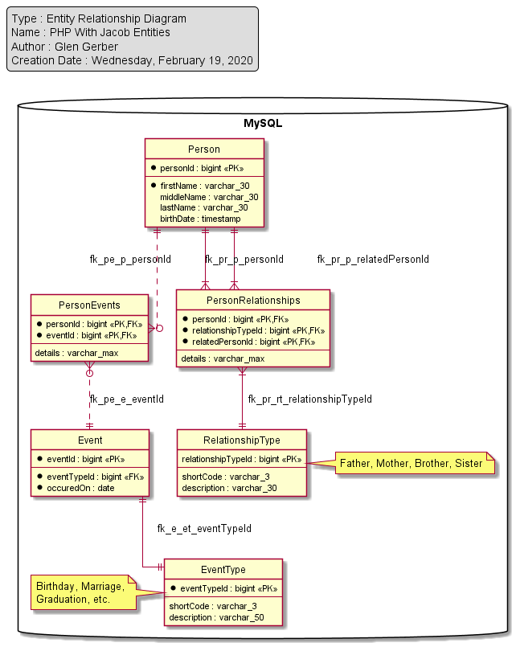

## Person

#### Sample Data
|id      |first_name |last_name    |birth_date       |
|:----   |:----------|:------------|:----------------|
|1       |Glen       |Gershner     |1948-09-08       |
|2       |Jacob      |Gershner     |1973-02-23       |

*Table 1 - Sample Person Data*

[Creation Script for Person Table](./src/sql/Tables/Person.sql)

## Event
|eventId |evenTypeId |occuredOn    |
|:----   |:----------|:------------|
|1       |1          |1948-09-08   |
|2       |1          |1993-02-23   |
|3       |2          |1990-09-17   |

*Table 2 - Sample Event Data*

[Creation script for Event Table](./src/sql/Tables/Event.sql)

## EventType
|eventTypeId |shortCode |description           |
|:----       |:---------|:------------         |
|1           |BD        |BirthDay              |
|2           |MG        |Marriage              |
|3           |HG        |Highschool Graduation |

*Table 3 - Sample EventType Data*

[Creation script for EventType Table](./src/sql/Tables/EventType.sql)

## PersonEvents
|personId |eventId   |details                         |
|:----    |:---------|:------------                   |
|1        |1         |Born in Los Angelos, California |
|1        |3         |Palm Springs California         |

*Table 4 - Sample PersonEvents Data*

[Creation script for PersonEvents Table](./src/sql/Tables/PersonEvents.sql)

## PersonRelationships
|personId |relationshipTypeId |relatedPersonId   | details                      |
|:----    |:-------           |:---------        |:-----------                  |
|1        |1                  |2                 |Good friend                   |

*Table 5 - Sample PersonRelationships Data*

[Creation script for PersonRelationships Table](./src/sql/Tables/PersonRelationships.sql)

## RelationshipType
|relationshipTypeId |shortCode  |description                                    |
|:------            |:------    |:--------                                      |
|1                  |DAD        |Father                                         |
|2                  |MOM        |Mother                                         |

*Table 6 - Sample RelationshipType Data*

[Creation script for RelationshipType Table](./src/sql/Tables/RelationshipType.sql)
